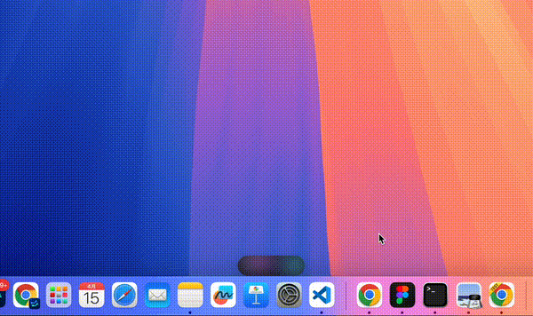

# LumiTerm

**Your terminal, always one hover away.**

[](https://github.com/ayov33/LumiTerm/releases)
[](https://github.com/ayov33/LumiTerm/releases)
[](LICENSE)
[](https://github.com/ayov33/LumiTerm)

A floating terminal for macOS that docks to your screen edge, expands on hover, and disappears when you don't need it. Built for designers, PMs, and anyone who uses the command line without wanting it to take over their screen.

> **[中文介绍](#中文介绍)**

<p align="center">
  
  <br><em>Hover the edge. Terminal appears. Move away. It's gone.</em>
</p>

<details>
<summary>Screenshots</summary>
<p align="center">
  
  <br>
  
  
</p>
</details>

---

## Features

- **Hover to expand** — move your cursor to the screen edge, the terminal slides out. Move away, it slides back. Zero clicks.
- **Edge docking** — snap to any screen edge (top, bottom, left, right) with drag-and-drop
- **Collapsed status bar** — see terminal state (Running / Idle / Done) at a glance, even when collapsed
- **Ripple notification** — a subtle glow animation when your command finishes, no disruptive system alerts
- **Multi-tab** — up to 5 terminal tabs with rename support (Cmd+1~5 to switch)
- **Global hotkey** — double-tap `Right Option` to toggle from anywhere (pinned mode)
- **3 color themes** — Default, Tokyo Night, Catppuccin Mocha — switch in Settings
- **Native performance** — built with Swift + AppKit, terminal powered by xterm.js via WKWebView
- **Transparent & minimal** — semi-transparent panel with aurora/pixel-pet animations in collapsed mode

## Why LumiTerm?

Most terminals are built for developers. LumiTerm is built for everyone who uses the command line but doesn't want it taking over their screen.

| Feature | LumiTerm | iTerm2 Visor | Ghostty Quick | Warp |
|---------|:--------:|:------------:|:-------------:|:----:|
| Hover to expand (zero-click) | **Yes** | No | No | No |
| Collapsed status bar | **Yes** | No | No | No |
| Command completion notification | **Ripple glow** | No | No | Toast |
| Edge docking (all 4 sides) | **Yes** | Top only | Top only | No |
| Color themes | **3 built-in** | Many | Limited | Many |
| Aurora / Pixel Pet animations | **Yes** | No | No | No |
| Semi-transparent panel | **Yes** | Yes | No | No |
| Zero config needed | **Yes** | Needs setup | Needs config | Account required |
| App size | **~1 MB** | ~30 MB | ~15 MB | ~90 MB |
| Open source | **MIT** | GPL-2.0 | MIT | Proprietary |

**LumiTerm's sweet spot:** You're in Figma / Notion / a browser full-screen, you need to run a quick command, and you don't want to Cmd+Tab away. Just hover the edge — the terminal is there. Move your mouse back — it's gone.

## Requirements

- macOS 13 (Ventura) or later
- Apple Silicon or Intel Mac (universal binary)

## Install

### Download (recommended)

Download the latest `.app` from [GitHub Releases](https://github.com/ayov33/LumiTerm/releases), unzip, and drag to Applications.

> First launch: right-click → Open (unsigned app, macOS will ask for confirmation once).

### Build from source

```bash
git clone https://github.com/ayov33/LumiTerm.git
cd LumiTerm
bash scripts/package.sh    # builds and creates dist/LumiTerm.app
open dist/LumiTerm.app
```

## Usage

1. LumiTerm runs as a **menu bar app** (no Dock icon)
2. A thin capsule appears on your screen edge — hover over it to expand the terminal
3. Move your cursor away to collapse it back
4. Double-tap `Right Option` to toggle and pin the terminal
5. Click the menu bar icon for quick access to Settings and Toggle

### Settings

Open from the menu bar icon → **Settings...**

| Tab | Options |
|-----|---------|
| General | Launch at Login, Global Hotkey, Dock Position |
| Appearance | Capsule style (Aurora / Pixel Pet), Panel opacity, Font size |
| Notifications | Finished alert, Completion sound |
| About | Version info |

## Architecture

```
Sources/
├── main.swift                 # Entry point
├── AppDelegate.swift          # App lifecycle & menu bar
├── FloatingPanel.swift        # Borderless floating NSPanel
├── WindowStateManager.swift   # Expand/collapse state machine
├── StatusBarView.swift        # Collapsed capsule (aurora/pixel pet)
├── TerminalViewController.swift  # WKWebView + xterm.js bridge
├── PTY.swift                  # Pseudo-terminal (forkpty)
├── OutputMonitor.swift        # Detect running/idle/done
├── ScreenEdgeMonitor.swift    # Mouse proximity detection
├── SettingsWindowController.swift  # Preferences window
├── Theme.swift                # Design tokens
└── Resources/terminal/
    ├── terminal.html          # Tab bar + xterm.js UI
    ├── aurora.html            # Capsule animation
    ├── xterm.js / xterm.css   # Terminal emulator
    ├── addon-fit.js           # Auto-resize addon
    └── sprites/               # Pixel pet SVGs
```

## Dependencies

| Dependency | Version | License |
|------------|---------|---------|
| [xterm.js](https://xtermjs.org) | ~5.x (bundled) | MIT |
| xterm-addon-fit | ~0.8.x (bundled) | MIT |

Zero Swift package dependencies. Terminal rendering via xterm.js in WKWebView.

## License

[MIT](LICENSE)

---

## 中文介绍

**LumiTerm** 是一款 macOS 浮动终端，专为需要在全屏应用和命令行之间频繁切换的用户设计。

### 核心特性

- **悬停展开** — 鼠标移到屏幕边缘自动展开终端，移走自动收起，零点击
- **边缘吸附** — 拖拽到屏幕任意边缘（上/下/左/右）自动吸附
- **折叠状态栏** — 收起时仍可看到终端状态（运行中/空闲/完成）
- **涟漪通知** — 命令完成时以柔和光晕动画提醒，不打断工作流
- **多标签页** — 最多 5 个终端标签，Cmd+1~5 切换
- **全局热键** — 双击右侧 `Option` 键随时唤出并固定
- **3 套配色主题** — Default / Tokyo Night / Catppuccin Mocha
- **原生性能** — Swift + AppKit 构建，xterm.js 渲染终端

### 为什么选 LumiTerm？

| 功能 | LumiTerm | iTerm2 Visor | Ghostty Quick | Warp |
|------|:--------:|:------------:|:-------------:|:----:|
| 悬停展开（零点击） | **有** | 无 | 无 | 无 |
| 折叠状态栏 | **有** | 无 | 无 | 无 |
| 命令完成通知 | **涟漪动效** | 无 | 无 | Toast |
| 四边停靠 | **有** | 仅顶部 | 仅顶部 | 无 |
| 零配置即用 | **是** | 需设置 | 需配置 | 需注册 |
| 体积 | **~1 MB** | ~30 MB | ~15 MB | ~90 MB |

**使用场景：** 你在 Figma / Notion / 浏览器里全屏工作，需要跑个命令——鼠标移到边缘，终端就在那里；鼠标移走，它就消失。

### 安装

从 [GitHub Releases](https://github.com/ayov33/LumiTerm/releases) 下载 `.app`，解压即用。

或源码编译：
```bash
git clone https://github.com/ayov33/LumiTerm.git
cd LumiTerm
bash scripts/package.sh
open dist/LumiTerm.app
```

需要 macOS 13+。
