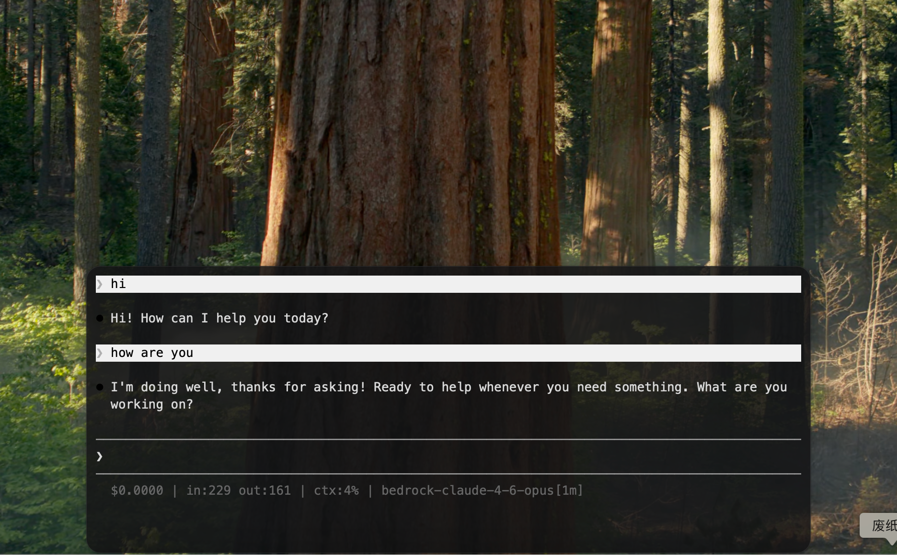

# LumiTerm

A lightweight floating terminal for macOS that stays out of your way until you need it.

**LumiTerm** is a floating terminal companion designed for designers, PMs, and anyone who switches between full-screen apps and the command line. It docks to your screen edge, expands on hover, and quietly notifies you when tasks complete.

> **[中文介绍](#中文介绍)**

<p align="center">
  
  <br>
  
  
</p>

---

## Features

- **Hover to expand** — move your cursor to the screen edge, the terminal slides out. Move away, it slides back. Zero clicks.
- **Edge docking** — snap to any screen edge (top, bottom, left, right) with drag-and-drop
- **Collapsed status bar** — see terminal state (Running / Idle / Done) at a glance, even when collapsed
- **Ripple notification** — a subtle glow animation when your command finishes, no disruptive system alerts
- **Multi-tab** — up to 3 terminal tabs with rename support (double-click to rename)
- **Global hotkey** — double-tap `Right Option` to toggle from anywhere (pinned mode)
- **Native performance** — built with Swift + AppKit, terminal powered by xterm.js via WKWebView
- **Transparent & minimal** — semi-transparent panel with aurora/pixel-pet animations in collapsed mode

## Requirements

- macOS 13 (Ventura) or later
- Swift 5.9+

## Install

### Download (recommended)

Download the latest `.app` from [GitHub Releases](https://github.com/ayov33/LumiTerm/releases), unzip, and drag to Applications.

> First launch: right-click → Open (unsigned app, macOS will ask for confirmation once).

### Build from source

```bash
git clone https://github.com/ayov33/LumiTerm.git
cd LumiTerm
bash scripts/package.sh    # builds and creates dist/LumiTerm.app
open dist/LumiTerm.app
```

## Usage

1. LumiTerm runs as a **menu bar app** (no Dock icon)
2. A thin capsule appears on your screen edge — hover over it to expand the terminal
3. Move your cursor away to collapse it back
4. Double-tap `Right Option` to toggle and pin the terminal
5. Click the menu bar icon for quick access to Settings and Toggle

### Settings

Open from the menu bar icon → **Settings...**

| Tab | Options |
|-----|---------|
| General | Launch at Login, Global Hotkey, Dock Position |
| Appearance | Capsule style (Aurora / Pixel Pet), Panel opacity, Font size |
| Notifications | Finished alert, Completion sound |
| About | Version info |

## Architecture

```
Sources/
├── main.swift                 # Entry point
├── AppDelegate.swift          # App lifecycle & menu bar
├── FloatingPanel.swift        # Borderless floating NSPanel
├── WindowStateManager.swift   # Expand/collapse state machine
├── StatusBarView.swift        # Collapsed capsule (aurora/pixel pet)
├── TerminalViewController.swift  # WKWebView + xterm.js bridge
├── PTY.swift                  # Pseudo-terminal (forkpty)
├── OutputMonitor.swift        # Detect running/idle/done
├── ScreenEdgeMonitor.swift    # Mouse proximity detection
├── SettingsWindowController.swift  # Preferences window
├── Theme.swift                # Design tokens
└── Resources/terminal/
    ├── terminal.html          # Tab bar + xterm.js UI
    ├── aurora.html            # Capsule animation
    ├── xterm.js / xterm.css   # Terminal emulator
    ├── addon-fit.js           # Auto-resize addon
    └── sprites/               # Pixel pet SVGs
```

## License

[MIT](LICENSE)

---

## 中文介绍

**LumiTerm** 是一款 macOS 浮动终端，专为需要在全屏应用和命令行之间频繁切换的用户设计。

### 核心特性

- **悬停展开** — 鼠标移到屏幕边缘自动展开终端，移走自动收起，零点击
- **边缘吸附** — 拖拽到屏幕任意边缘（上/下/左/右）自动吸附
- **折叠状态栏** — 收起时仍可看到终端状态（运行中/空闲/完成）
- **涟漪通知** — 命令完成时以柔和光晕动画提醒，不打断工作流
- **多标签页** — 最多 3 个终端标签，双击可重命名
- **全局热键** — 双击右侧 `Option` 键随时唤出并固定
- **原生性能** — Swift + AppKit 构建，xterm.js 渲染终端

### 目标用户

不只是程序员的终端，而是所有在乎体验的人的终端 — 设计师、PM、创意工作者、前端开发者。

### 安装

从 [GitHub Releases](https://github.com/ayov33/LumiTerm/releases) 下载 `.app`，解压即用。

或源码编译：
```bash
git clone https://github.com/ayov33/LumiTerm.git
cd LumiTerm
bash scripts/package.sh
open dist/LumiTerm.app
```

需要 macOS 13+。
